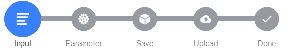

# State-Stepper

A states indicator for Ionic.



## Description

This is a very jung project. Please view the roadmap, before creating an issue.
Anyway I appreciate for any contribution.

This is a Ionic v3 component.

## Install

```bash
npm i state-stepper
```

[NPM Package](https://www.npmjs.com/package/state-stepper)

## Example

```html
<app-state-stepper #stepper [steps]="steps"></app-state-stepper>

<ion-button (click)="stepper.nextStep('success')">OK</ion-button>
<ion-button (click)="stepper.nextStep('warning')">Warn</ion-button>
<ion-button (click)="stepper.nextStep('danger')">Error</ion-button>
<ion-button (click)="stepper.reset()">Reset</ion-button>
```

```ts
steps = [
  {
    icon: 'list',
    text: 'Input'
  },
  {
    icon: 'cog',
    text: 'Parameter'
  },
  {
    icon: 'cube',
    text: 'Save'
  },
  {
    icon: 'cloud-upload',
    text: 'Upload'
  },
  {
    icon: 'checkmark',
    text: 'Done'
  }
];
```

## Roadmap

Folling is planned. Just ideas in unsorted order.

- Support Ionic 4 (not yet tested).
- Use Ionic color variables.
- Translate step.text by changing the layout. (e.g. accept steps as html ng-content.)
- Make this library neutral for every Angular project. (Not only Ionic).
- Step content. Every step in a tab container.
- Create demo website.

## License

[MIT License](LICENSE)

Copyright (c) 2019 Dominik Geng

Github @domske
