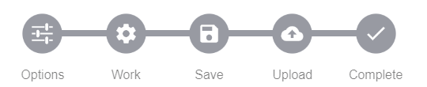

# State-Stepper

Progress steps visualizer.

> NOTE This version (2.x) of state-stepper is not compatible with the previous version (1.x).
> Version 1.x is for Ionic 3 and 2.x is a standard Web-Component to use everywhere. (Also Ionic 3 and 4).



Visualize your progress steps. This is a [Web-Component](https://developer.mozilla.org/en-US/docs/Web/Web_Components) you can use it everywhere and with everything you want. Every framework like [Angular](https://angular.io/), [Vue](https://vuejs.org/), [React](https://reactjs.org/) and UIs like [Ionic](https://ionicframework.com/), [Material](https://material.angular.io/) or [Vuetify](https://vuetifyjs.com). Or just use it in vanilla JavaScript or TypeScript. Just load and use it.

You can use any element for the icon and text. For example the `ion-icon` of [Ionic](https://ionicons.com/).

## Installation

This Web-Component is also available at [NPM](https://www.npmjs.com/package/state-stepper)

```text
npm i state-stepper
```

```ts
import `state-stepper`;
```

[Angular Integration](https://stenciljs.com/docs/angular)

## Usage

This example shows the state-stepper element with Ionic icons and pure JavaScript. But you can adept this for each Framework. e.g. ng-for, v-for, etc. for your steps.

**HTML**

```html
<state-stepper>
  <state-stepper-step state="danger">
    <ion-icon name="options" slot="icon"></ion-icon>
    <span slot="text">Options</span>
  </state-stepper-step>
  <state-stepper-step state="success">
    <ion-icon name="settings" slot="icon"></ion-icon>
    <span slot="text">Work</span>
  </state-stepper-step>
  <state-stepper-step state="warning">
    <ion-icon name="save" slot="icon"></ion-icon>
    <span slot="text">Save</span>
  </state-stepper-step>
  <state-stepper-step state="active">
    <ion-icon name="cloud-upload" slot="icon"></ion-icon>
    <span slot="text">Upload</span>
  </state-stepper-step>
  <state-stepper-step>
    <ion-icon name="checkmark" slot="icon"></ion-icon>
    <span slot="text">Complete</span>
  </state-stepper-step>
</state-stepper>
```

**JS**

```js
const stateStepper = document.querySelector('state-stepper');
stateStepper.stepNext('warn');
stateStepper.stepNext('success');
stateStepper.stepNext('success');
stateStepper.stepNext('danger', true);
stateStepper.stepBack();
stateStepper.resetSteps();
```

Remeber `DOMContentLoaded` [event](https://developer.mozilla.org/en-US/docs/Web/API/Window/DOMContentLoaded_event) if you get undefined.

## Methods

`stepNext(currentState: string, stop = false): Promise<boolean>`

Jumps to the next step.

| Argument     | Description                            |
| ------------ | -------------------------------------- |
| currentState | The state for the current active step. |
| stop         | (Optional) Stops at current step.      |

Returns `true` if the all steps are completed.

---

`resetSteps(stepIndex = 0): Promise<void>`

Resets all steps. You can also use it to start or jump back to a specific step.

| Argument  | Description                                  |
| --------- | -------------------------------------------- |
| stepIndex | (Optional) The index to step back. (0-based) |

---

`stepBack(): Promise<void>`

Steps back to the previous step. One step back from the active step.

---

It's recommended to manage the steps by yourself instead of using the methods. Use the `state` attribute of a step.

If your steps overflows the view, it automatically scrolls to the active state on initial load and every change of active step.

## Roadmap

It is planned to create an Angular wrapper for it in the future. Be free to support this software.

## License

MIT Copyright (c) 2019 Dominik Geng

[See license](LICENSE)
